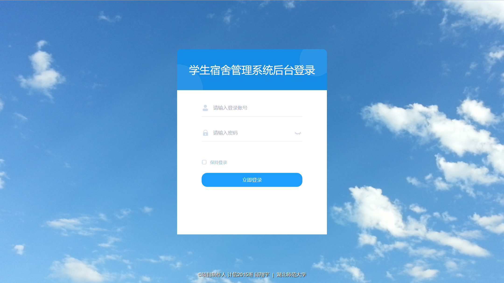
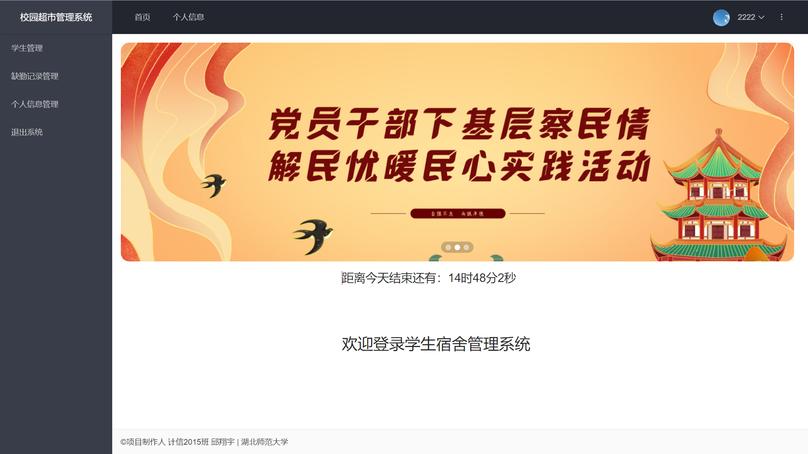
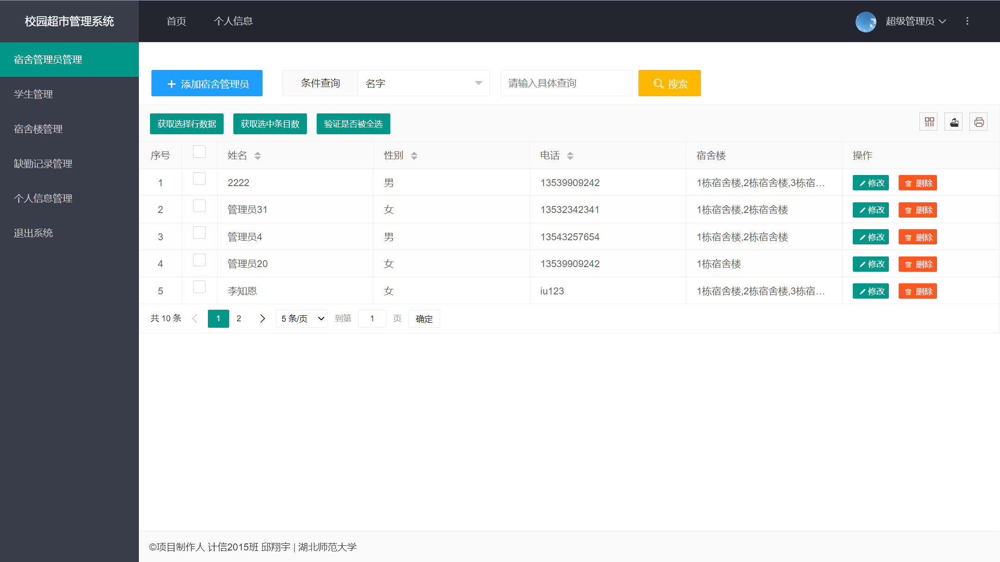
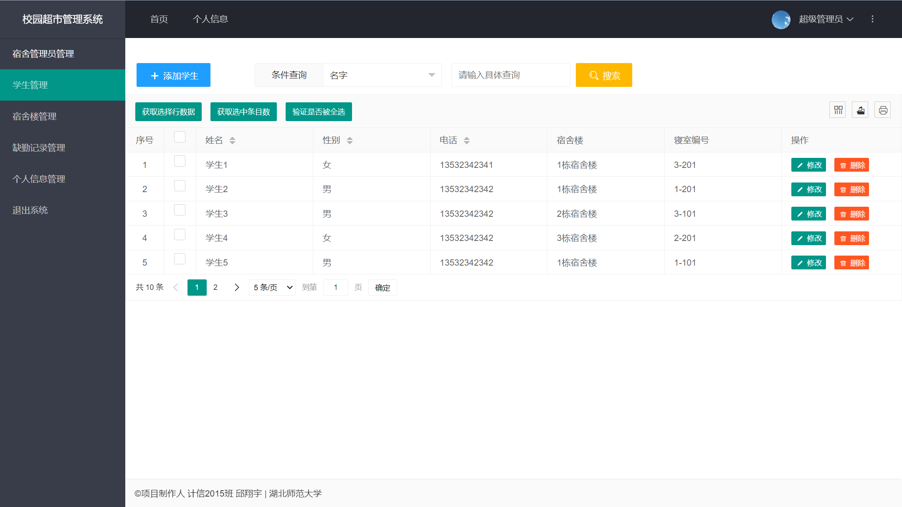
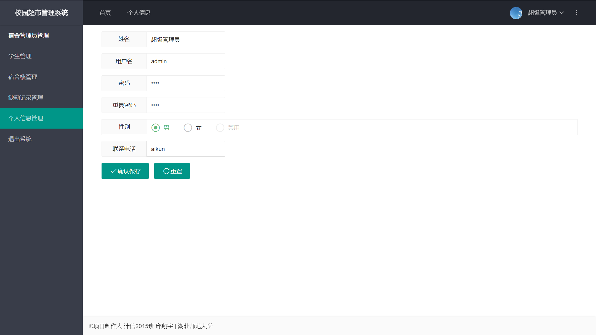

## DormitoryManage

## 一、项目简介

> 项目简述：

本系统采用MVC+J2EE+MYSQL实现，使用是Tomcat10.0作为WEB服务器，提供适应性强的Internet服务器功能，具有很高的执行效率。其中：

- JSP用于页面的设计，展示数据
- Java用来处理具体业务逻辑，后台跳转、对数据库操作，实现对数据库的增、删、改等操作。
- JavaScript用于异步刷新页面和跳转页面。

本次高校宿舍管理系统能够满足用户的基本需求，方便快捷，既节省了时间，提高了效率，又节约了开发成本，给宿舍管理带来了极大的改善。


>开发工具：

- 操作系统：windows 11
- Java虚拟机：JDK1.8
- Java开发工具：IntelliJ IDEA 2021.2
- Web服务器：Tomcat10.0
- 数据库系统：Mysql8.0
- 数据库管理工具：Navicat


> 所用技术：

- 后端方面：JavaSe核心语法、MVC（controlle层、service、dao层）模型开发、jsp相关语法（jstl标签库、el表达式）、maven构建项目和管理jar包
- 前端方面：JavaScript(jquery)核心语法、AJAX异步刷新、Layui前端 UI 框架
- 数据库方面：Mysql基本的DDL、DML语法


> 项目结构：


```xml
src                                 
 |--main
     |--java         源代码目录
     	|--constant		常量
     	|--controller	存放servlet和页面进行交互
     	|--dao		    存放dao和数据库进行交互
     	|--entity		和数据库表对应的实体类
        |--exception	 自定义异常信息
        |--filter		 过滤器
        |--service		 存放service处理具体业务逻辑
        |--utils		 存放工具类
     |--resources    资源目录      
 |--test			
     |--java         测试代码目录
     |--resources    测试资源目录
 |--webapp			具有web特性的目录    
|--target
 |--classes      编译后的class文件目录
 |--test-classes 编译后的测试class文件目录
 |--artifacts	 web项目的成品
pom.xml             Maven工程配置文件
```


> 总结：jsp用于作页面展示，ajax用于异步刷新，java处理具体业务逻辑


## 二、预计实现的功能

1. **用户登录模块**：超级管理员、宿舍管理员、学生三种不同角色的用户登录系统，呈现不同的界面，添加过滤器，没登陆的则不能访问其它界面
2. **超级管理员模块**：超级管理员具有宿舍管理员管理、学生管理、宿舍楼管理、缺勤记录管理、修改密码、退出系统的权限
   1. 超级管理员主页：显示轮播图、每天的倒计时和其它的信息
   2. 宿舍管理员管理：可以分页显示显示、添加、删除、修改、查找（按名字模糊查询、按性别查询）、排序宿舍管理员信息
   3. 学生管理：可以分页显示显示、添加、删除、修改、查找（按名字模糊查询、按性别查询）、排序学生信息
   4. 宿舍楼管理：可以分页显示显示、添加、删除、修改、查找（按名字模糊查询）、排序宿舍楼信息
   5. 缺勤记录管理：可以分页显示所有学生的缺勤记录信息、添加、删除、修改、查找（按日期查询）、排序缺勤记录信息
   6. 个人信息管理：可以显示、修改自己的个人信息（包括：用户名、密码、昵称、联系方式、性别）
   7. 退出系统：无异常，清除session等登录记录，退出系统
3. **宿舍管理员模块**：宿舍管理员具有学生管理、缺勤记录管理、修改密码、退出系统的权限
   1. 宿舍管理员主页：显示轮播图、每天的倒计时和其它的信息
   2. 学生管理：可以分页显示显示、添加、删除、修改、查找（按名字模糊查询、按性别查询）、排序学生信息
   3. 缺勤记录管理：可以分页显示所有学生的缺勤记录信息、添加、删除、修改、查找（按日期查询）、排序缺勤记录信息
   4. 个人信息管理：可以显示、修改自己的个人信息（包括：用户名、密码、昵称、联系方式、性别）
   5. 退出系统：无异常，清除session等登录记录，退出系统
4. **学生模块**：学生具有查看、查找自己缺勤记录、修改密码、退出系统的权限
   1. 学生主页：显示轮播图、每天的倒计时和其它的信息
   2. 缺勤记录管理：可以分页显示、查找（按日期查询）、排序自己的缺勤记录信息
   3. 个人信息管理：可以显示、修改自己的个人信息（包括：用户名、密码、昵称、联系方式、性别）
   4. 退出系统：无异常，清除session等登录记录，退出系统


## 三、项目展示

> 登录模块：




> 超级管理员模块：


> 宿舍管理员模块：




> 学生模块：


> 功能模块：



---



---


---


---




### 四、总结

​	该项目非常时候学完了Java第一阶段的JavaSe、Mysql、JDBC和第二阶段的JavaEE，但是对自身实例感觉不足的同志，是一个很好的能够让你引入开发的界面。

 开始动手吧！


### 五、附学习链接

1. JavaSe
   - 基础：【【零基础 快速学Java】韩顺平 零基础30天学会Java】 https://www.bilibili.com/video/BV1fh411y7R8/?share_source=copy_web&vd_source=72f759c8addc4f3c9333c6deee60fc90
   - 进价：【【资料全】有深度的javase教程，java入门进阶必看】 https://www.bilibili.com/video/BV1h64y1i78N/?share_source=copy_web&vd_source=72f759c8addc4f3c9333c6deee60fc90
2. Mysql
   - 基础：【【it楠老师私房课】mysql8.0数据库入门篇章】 https://www.bilibili.com/video/BV1h5411m747/?share_source=copy_web&vd_source=72f759c8addc4f3c9333c6deee60fc90
   - 进价：【MySQL数据库教程天花板，mysql安装到mysql高级，强！硬！】 https://www.bilibili.com/video/BV1iq4y1u7vj/?share_source=copy_web&vd_source=72f759c8addc4f3c9333c6deee60fc90
3. JarkataEE
   - 【【白送资料】有料有深度的javaweb教程，tomcat10讲解】 https://www.bilibili.com/video/BV14T4y1f7Ho/?share_source=copy_web&vd_source=72f759c8addc4f3c9333c6deee60fc90
4. 前端
   - 【【2021就业班】前端入门，html，css入门学习】 https://www.bilibili.com/video/BV11A411s7Dj/?share_source=copy_web&vd_source=72f759c8addc4f3c9333c6deee60fc90
   - 【【2021就业班】javascript入门，讲的快必须有java基础，未完持续更新中】 https://www.bilibili.com/video/BV1DT4y1K7Fd/?share_source=copy_web&vd_source=72f759c8addc4f3c9333c6deee60fc90
   - 【2021最新最细致的LayUI【前端框架】从入门到实战-快速搭建后台管理系统,layui框架精讲全套视频教程（新版LayUI已上传，推荐观看）前端界面必学框架】 https://www.bilibili.com/video/BV19V411b7sx/?share_source=copy_web&vd_source=72f759c8addc4f3c9333c6deee60fc90

